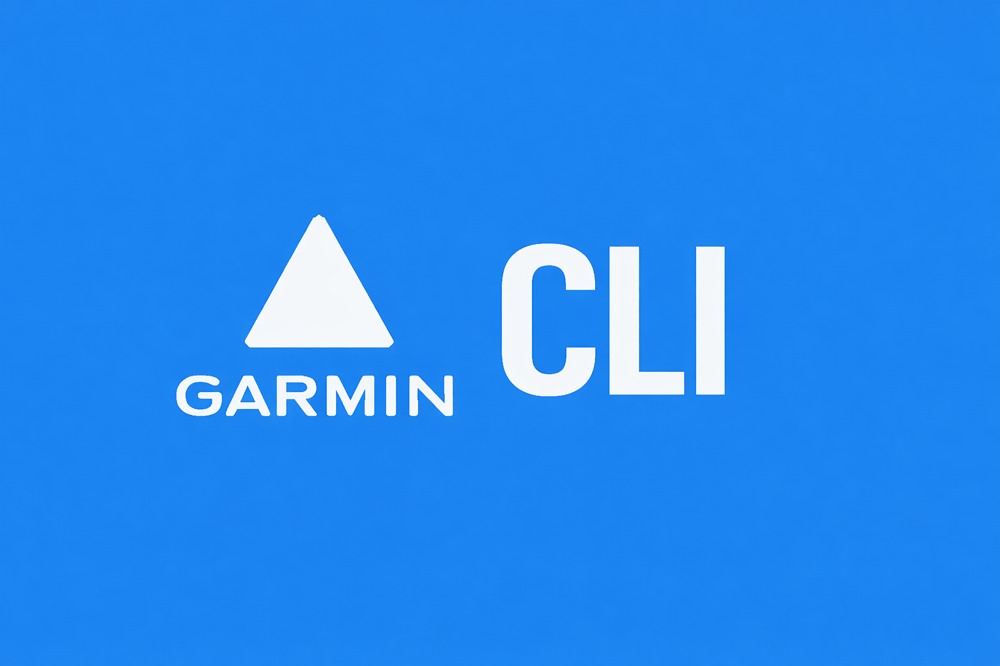

# Garmin Connect CLI



Garmin Connect from your terminal. Pipe it, script it, automate it.

> Exploring CLI tools as skills for AI agents. [Background below](#background).

## Features

- All your Garmin data — activities, stats, sleep, heart rate, stress, body battery
- Script and automate — composable with jq, pipes, xargs, and standard Unix tools
- [AI agent ready](#ai-agent-integration) — install the skill for Claude, Cursor, and other assistants
- Flexible output — JSON for scripts, CSV for spreadsheets, tables for humans

## Installation

### Quick Install (Recommended)

```bash
curl -fsSL https://raw.githubusercontent.com/eddmann/garmin-connect-cli/main/install.sh | sh
```

Downloads the pre-built binary for your platform (macOS/Linux) to `~/.local/bin`.

### Homebrew

```bash
brew install eddmann/tap/garmin-connect-cli
```

### Using uv/pipx

Requires Python 3.10+ and [uv](https://docs.astral.sh/uv/).

```bash
uv tool install git+https://github.com/eddmann/garmin-connect-cli.git
```

### From Source

```bash
git clone https://github.com/eddmann/garmin-connect-cli
cd garmin-connect-cli
uv sync
uv run garmin-connect --help
```

## Quick Start

```bash
# Authenticate with Garmin Connect
garmin-connect auth login

# List recent activities
garmin-connect activities list --limit 10

# Get today's stats
garmin-connect athlete stats

# Get sleep data
garmin-connect health sleep

# Get aggregated context for LLMs
garmin-connect context
```

## Command Reference

### Global Options

| Flag          | Short | Description                                           |
| ------------- | ----- | ----------------------------------------------------- |
| `--format`    | `-f`  | Output format: json (default), jsonl, csv, tsv, human |
| `--fields`    |       | Comma-separated list of fields to include             |
| `--no-header` |       | Omit header row in CSV/TSV output                     |
| `--verbose`   | `-v`  | Verbose output to stderr                              |
| `--quiet`     | `-q`  | Suppress non-essential output                         |
| `--config`    | `-c`  | Path to config file                                   |
| `--profile`   | `-p`  | Named profile to use                                  |
| `--version`   | `-V`  | Show version and exit                                 |

### Authentication

Tokens are stored in `~/.config/garmin-connect-cli/tokens/` and remain valid for approximately one year. MFA is supported.

```bash
garmin-connect auth login                    # Interactive login
garmin-connect auth login --email EMAIL      # With credentials
garmin-connect auth status                   # Check status
garmin-connect auth logout                   # Clear tokens
garmin-connect auth login --profile work     # Named profile
```

### Commands

Use `garmin-connect <command> --help` for full details.

| Command                    | Description                                                           |
| -------------------------- | --------------------------------------------------------------------- |
| `activities list`          | List activities (supports `--limit`, `--after`, `--before`, `--type`) |
| `activities get <id>`      | Get activity details (`--details` for extended info)                  |
| `activities splits <id>`   | Get activity splits/laps                                              |
| `activities download <id>` | Download as GPX/TCX/FIT (`--format`, `-o`)                            |
| `activities upload <file>` | Upload activity file                                                  |
| `activities delete <id>`   | Delete activity (`--force` to skip confirmation)                      |
| `athlete`                  | Get user profile                                                      |
| `athlete stats`            | Daily statistics (`--date`)                                           |
| `athlete summary`          | Comprehensive summary with body metrics                               |
| `health sleep`             | Sleep data (`--date`)                                                 |
| `health heart-rate`        | Heart rate data                                                       |
| `health rhr`               | Resting heart rate                                                    |
| `health steps`             | Step count                                                            |
| `health stress`            | Stress levels                                                         |
| `health body-battery`      | Body battery                                                          |
| `training status`          | Training status (Productive, Peaking, etc.)                           |
| `training readiness`       | Training readiness score (0-100)                                      |
| `training vo2max`          | VO2 max estimates                                                     |
| `training hrv`             | Heart rate variability                                                |
| `training fitness-age`     | Fitness age                                                           |
| `weight list`              | Weight entries (`--start`, `--end`)                                   |
| `weight get`               | Weight for date (`--date`)                                            |
| `weight log <kg>`          | Log weight measurement                                                |
| `context`                  | Aggregated data for LLMs (`--focus`, `--activities`, `--no-health`)   |

## Configuration

CLI preferences are stored in `~/.config/garmin-connect-cli/config.toml`:

```toml
[defaults]
format = "json"
limit = 30

[profiles.work]
email = "work@example.com"
```

Authentication tokens are managed by the [Garth](https://github.com/matin/garth) library and stored in `~/.config/garmin-connect-cli/tokens/`.

### Environment Variables

| Variable          | Description             |
| ----------------- | ----------------------- |
| `GARMIN_EMAIL`    | Garmin Connect email    |
| `GARMIN_PASSWORD` | Garmin Connect password |
| `GARMIN_FORMAT`   | Default output format   |
| `GARMIN_PROFILE`  | Default profile name    |
| `GARMIN_CONFIG`   | Path to config file     |

## Composability

```bash
# Filter runs over 10km (distance in meters)
garmin-connect activities list --type running | jq '.[] | select(.distance > 10000)'

# Total running distance in km
garmin-connect activities list --type running | jq '[.[].distance] | add / 1000'

# Get recent activities with key metrics
garmin-connect activities list --limit 5 | jq '.[] | {name: .activityName, km: (.distance/1000), mins: (.duration/60)}'
```

## AI Agent Integration

This CLI is available as an [Agent Skill](https://agentskills.io/) — it works with Claude Code, Cursor, and other compatible AI agents. See [`SKILL.md`](SKILL.md) for the skill definition.

### Install Agent Skill

```bash
curl -fsSL https://raw.githubusercontent.com/eddmann/garmin-connect-cli/main/install-skill.sh | sh
```

Installs the skill to `~/.claude/skills/garmin-connect/` and `~/.cursor/skills/garmin-connect/`. Agents will auto-detect when you ask about Garmin/fitness data.

## Development

```bash
git clone https://github.com/eddmann/garmin-connect-cli
cd garmin-connect-cli
make install                          # Install dependencies
make test                             # Run tests
make run CMD="activities list --limit 5"  # Run command
```

## Background

I recently built [garmin-connect-mcp](https://github.com/eddmann/garmin-connect-mcp), an MCP server for Garmin Connect. This got me thinking about alternative approaches to giving AI agents capabilities.

There's been a lot of discussion around the heavyweight nature of MCP. An alternative approach is to give agents [discoverable skills](https://www.anthropic.com/engineering/equipping-agents-for-the-real-world-with-agent-skills) via well-documented CLI tooling. Give an LLM a terminal and let it use composable CLI tools to build up functionality and solve problems — the Unix philosophy applied to AI agents.

This project is an exploration of [Claude Code Skills](https://simonwillison.net/2025/Oct/16/claude-skills/) and the emerging [Agent Skills](https://agentskills.io/) standard for AI-tool interoperability. The goal was to build a CLI that works seamlessly as both:

1. **A traditional Unix tool** — composable, pipe-friendly, machine-readable
2. **An AI agent skill** — structured output, comprehensive documentation, predictable behavior

Going forward, another approach worth exploring is going one step further than CLI and providing a [code library that agents can import and use directly](https://www.anthropic.com/engineering/code-execution-with-mcp).

## License

MIT

## Credits

Built on top of [python-garminconnect](https://github.com/cyberjunky/python-garminconnect) by cyberjunky.
